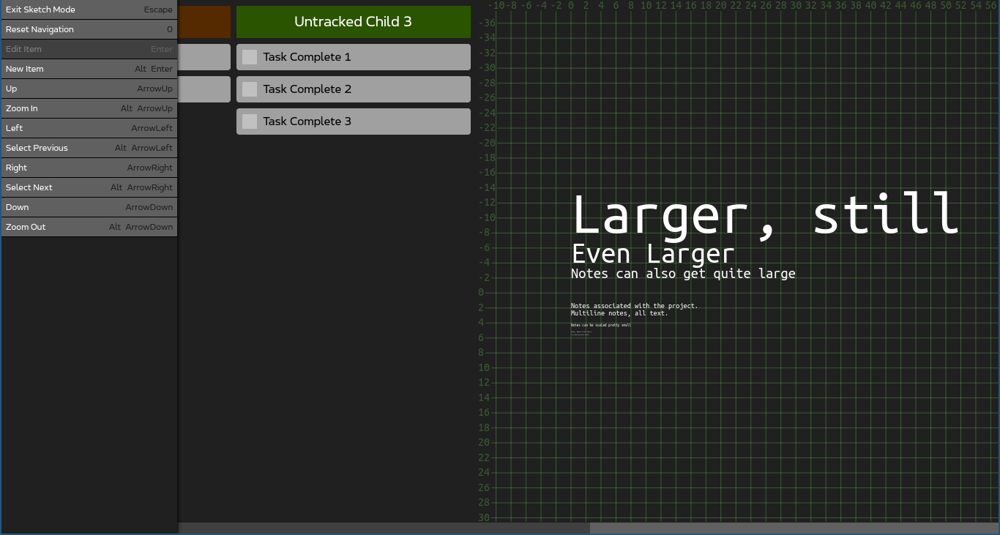

# Formica Project Manager
Create and manage .4mica project files composed of infinitely nestable nodes that represent individual projects tasks. Organize projects or project parts into nested checklists or Kanban boards. Associate tasks with files or URLs. Create notes for tasks in a scalable 2-dimensional sketch area. Keep track of a task's progress, concerns, and changes in its log.

Why is it called Formica? Mostly because ants are cool. But also, you can think of an ant nest as a loose metaphor for the structure of a Formica project, organized into a series of many different rooms, connected by tunnels that associate one with the next, each performing some necessary function in service of the goals of the colony.

## Anatomy of a Project
Formica is designed to organize a single project in a project file. 
In reality, because of the nesting nature of the project structure, any number of projects can be included into a single project file, if desired 

Each project is composed entirely of Nodes. 
Nodes are composed of: 
a Title: a name for the Node, which must be unique across the document; 
a Statement: a multiline block of text, where the primary objectives of the Node are clearly stated; 
its Children: an ordered list of Nodes, a more granular and trackable breakdown of the Node's objectives; 
its Links: an ordered list of filepaths or URLs associated with the Node; 
its Sketch: a 2-dimensional area where auxillary text notes can be arranged and explored; 
its Log: a collection of text entries, for evaluating progress and possible improvements on the Node's objectives 
it Status: marking the task as complete, incomplete, or untracked. 

## The Node is a Task
Formica was designed around a simple method for organizing tasks.

Tasks are composed of three definitional parts: 
The Statement: a brief, specific statement of the primary objectives of the task. In Formica, this is the Node's Statement. 
The Breakdown: a list of the subtasks necessary to complete the task. In Formica, this is the Node's Children. 
The Review: where a tasks is periodically re-evaluated to determine if its stated objectives are being satisfied by the work beind done, and to consider possible improvement to the Breakdown. In Formica, this is the Node's Log. 

Most tasks can be either finite, or indefinite.

Finite tasks have a specific end state, after which the task is complete.

Indefinite tasks are continuous, and do not have a specific end state.

A finite task may be to build a new ant nest for the colony, an indefinite task may be to maintain that nest after construction.

Finite tasks are more likely to be composed of finite subtasks, that may only need to be completed once. Indefinite tasks are more likely to be composed of a list of tasks that must be completed periodically, or states that must be continuously maintained.

Because of the nature of the differences between finite and indefinite tasks, the review process for each should be addressed differently.
Finite task reviews should focus more on evaluating the trajectory of the completed work, and whether or not that is the best way to achieve the stated objectives.
Indefinite tasks, which by nature may be less dynamic, should focus more on listing possible improvements to the processes for achieving the stated objectives.

## The Tree
Navigating nested nodes need not necessitiate nightmarish nonsense.

Nodes, in the end, are really just fancy nested checklists. But imagine composing a large project of many levels of nested nodes, and then trying to navigate through them, *as checklists*:
"Was it in this Node?" Click. "Oh, no, maybe the one before it" Back. Sroll. Click. "Nope, not this one" Back. Scroll. Click. Click. Click.

Rather than displaying Nodes as Tasklists or Kanban boards by default, they're displayed as a tree, starting with the root element. You can navigate by clicking around, or by using the arrow key on the keyboard.
Navigate to a Node and click Enter to view it as a Tasklist or Kanban board.

Orphaned Nodes, those who were cut from their Parent Node and now have no Parent Nodes anywhere in the document, are displayed under the root Node, so that they are still accessible. Copy and paste them into other Nodes to get them back off of the main screen.

After clicking Enter from the Tree on the Node you want to open, it opens as either a Tasklist, or a Kanban board.

## The Tasklist
Tasklists display nodes a nested checklists. Tracked child Nodes and their tracked children are displayed in the upper list. Untrakced child nodes and their untracked children are displayed in the lower list.

You can change the depth of the list using the menu or keybind. This effect is purely visual.

## The Kanban
I know you, the fancy supervisor type. You don't just want some measly checklist, fancy nesting or not.
No, what you want is the *real* project management format. You want a Kanban board. Well, you're in luck.

Simply enter a Node, press Alt+m, and then select option 2, to convert your primitive little list into a **prime Kanban masterpiece**.

Untracked child Nodes are considered Stages. They are displayed in order.

Their children are considered the board's tasks. Use the menu or keybinds to move tasks from Stage to Stage.

Tracked child nodes are sorted off to the side in a little tasklist of their own. Use this for tracking meta tasks or other things that may not necessarily fit so easily into the model of the Kanban board, yet still belong with the project.

And finally, way off to the right of the board, is the sketch area. It's a little bigger in the Kanban view than the Tasklist view, but size doesn't matter much to the Sketch area.

## The Sketch
Each Node has a Sketch, which is just a board of little text notes that aren't tasks, maybe they're ideas or questions or auxillary information, whatever you need. Not everything has to be a task.

The Sketch area and entries into a Node's Sketch have a pretty wide range of sizes, and practically limitless space.

You can make some notes small.

You can also make them big.

Whatever floats your boat.

Now, I know what you're thinking. *But, what if I need to write down the location of a file? Or a website? Now I need to copy it, position it, and then enter it to copy over the path every time I want to access that file, or open that webpage? Sounds inconvenient.*
And you would be right. A Node's Sketch isn't for that. It's for taking notes during your DnD sessions.

What then, for remote resources?

## The Links
Save URLs or filepaths for quick and easy access to remote resources.

Click a link to open the link menu, (where you can replace or reorder a Node's links), and click the option to use your computer's default program to open that link.

*Beware*, this feature is not necessarily protected from malicious or incompetent use. Don't enter any shell commands in here, don't link to programs you don't want the computer to execute, don't feed it dangerous input, unless you know what you are doing.

On the other hand, if you don't know what any of that means, and you just wanna stuff the links to your favorite websites in there, feel free to proceed as you were without concern.

## The Log
Periodically review the progress of your project or task using its Node's Log functionality.
The most recent log is displayed under the Sketch in the Tree, and under the checklists in both Tasklists and Kanban boards.

Press the menu option or keybind to enter a new log. Condsider starting it with the current date, as a best practice.

Press the menu option or keybind to view the logbook in its entirety. Navigate, edit, or rearrange the previous logs as you see fit.

## Search
The Tree navigation is very convenient, but still, you can't find that one Node you made a while ago. You know what it was called, but where did you put it?
Your project is starting to get really populated. It's hard to find those missing Nodes you made last tuesday, at 2:30am, just before falling asleep at your desk.

Just use the Search. Find that missing node by entering a string of text as a search query, and looking through every nested child Node of the currently selected Node that has a Title or Statement that matches it. (Search is not smart, it's just using regex, so don't use multiple keywords or search engine commands.)

Click to enter the node, and then click Back in the menu to return to the Node you searched from.

Search doesn't return any information about who is a parent to the matched items, because they can have any number of parents and any number of children. We'll add that useful extra information in at a later date.

## Status
Nodes, as previously stated, can be complete, incomplete, or untracked. This impacts how they are viewed in Tasklists and Kanban boards. Tracked Nodes should generally represent finite tasks, and untracked Nodes should generally represent indefinite tasks (or Kanban stages).

Use the menu or keybinds to toggle between tracked and untracked, and between complete and incomplete for the tracked ones.
